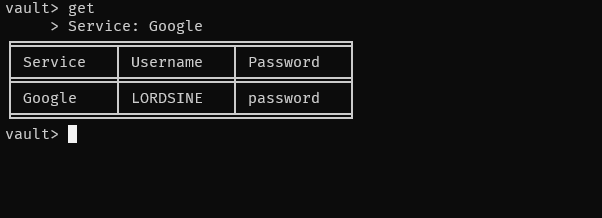

# Password Manager

A secure, command-line password manager built with Python that uses strong encryption to protect your sensitive data.


## Commands

<div align="center">

### Add


### Get


### List


### Delete


</div>

## Features

- **Strong Encryption**: Uses Fernet symmetric encryption (AES 128)
- **SQLite Database**: Secure local storage with encrypted passwords
- **CLI Interface**: Simple command-line interface
- **Organized Display**: Beautiful tabulated output using `tabulate`
- **Auto Key Management**: Automatic encryption key generation and management
- **Secure by Design**: Passwords are encrypted before storage

## Installation

### Prerequisites
- Python 3.7 or higher
- pip package manager

### Setup

1. **Clone the repository**
   ```bash
   git clone https://github.com/LORDSINE/PasswordManager.git
   cd PasswordManager
   ```

2. **Create and activate a virtual environment (recommended)**
   
   **On Windows:**
   ```bash
   python -m venv .venv
   .venv\Scripts\activate
   ```
   
   **On macOS/Linux:**
   ```bash
   python3 -m venv .venv
   source .venv/bin/activate
   ```

3. **Upgrade pip to latest version**
   ```bash
   python -m pip install --upgrade pip
   ```

4. **Install dependencies**
   ```bash
   pip install -r requirements.txt
   ```

5. **Run the password manager**
   ```bash
   python -m vault.cli
   ```

## Usage

### Available Commands

| Command | Description | Example |
|---------|-------------|---------|
| `add` | Add a new password entry | Stores service, username, and password |
| `get` | Retrieve a specific entry | Shows password for a service |
| `list` | Show all stored services | Displays all service names |
| `delete` | Remove an entry | Deletes service and its data |
| `exit` | Exit the program | Closes the password manager |

### Usage Examples

**Adding a new entry:**
```
vault> add
     > Service: GitHub
     > Username: john.doe@email.com
     > Password: mySecurePassword123
New Entry Saved!!!
```

**Retrieving an entry:**
```
vault> get
     > Service: GitHub
┌─────────┬────────────────────┬──────────────────────┐
│ Service │ Username           │ Password             │
├─────────┼────────────────────┼──────────────────────┤
│ GitHub  │ john.doe@email.com │ mySecurePassword123  │
└─────────┴────────────────────┴──────────────────────┘
```

## Project Structure

```
PasswordManager/
├── vault/                    # Main package
│   ├── __init__.py          # Package initialization
│   ├── cli.py               # Command-line interface
│   ├── crypto.py            # Encryption/decryption functions
│   └── storage.py           # Database operations
├── requirements.txt         # Project dependencies
├── README.md                # Project documentation
└── .gitignore              # Git ignore rules
```

## Technical Details

### Encryption
- **Algorithm**: Fernet (AES 128 in CBC mode with HMAC SHA256 for authentication)
- **Key Storage**: Auto-generated 256-bit key stored in `vault.key`
- **Data Protection**: Only passwords are encrypted; service names and usernames are stored in plaintext for search functionality

### Database Schema
```sql
CREATE TABLE vault (
    id INTEGER PRIMARY KEY AUTOINCREMENT,
    service TEXT UNIQUE,
    username TEXT,
    password TEXT  -- Encrypted
);
```

### File Structure
- `vault.db` - SQLite database with encrypted passwords
- `vault.key` - Encryption key (keep this file secure!)

## Security Considerations

- **Keep your `vault.key` file secure** - Anyone with this file can decrypt your passwords
- **Backup your data** - Store `vault.db` and `vault.key` in a secure location
- **Use strong master passwords** when storing critical accounts
- **Regular updates** - Keep dependencies updated for security patches

## Contributing

1. Fork the repository
2. Create a feature branch (`git checkout -b feature/amazing-feature`)
3. Commit your changes (`git commit -m 'Add amazing feature'`)
4. Push to the branch (`git push origin feature/amazing-feature`)
5. Open a Pull Request

## Author

**LORDSINE**
- GitHub: [@LORDSINE](https://github.com/LORDSINE)

## Version History

- **v0.1.0** (September 2025) - Initial release
  - Basic CLI functionality
  - Fernet encryption implementation
  - SQLite storage backend
  - Core commands: add, get, list, delete

---

**⚠️ Disclaimer**: This is a personal project for educational purposes. For production use, consider additional security measures and professional security audits.
